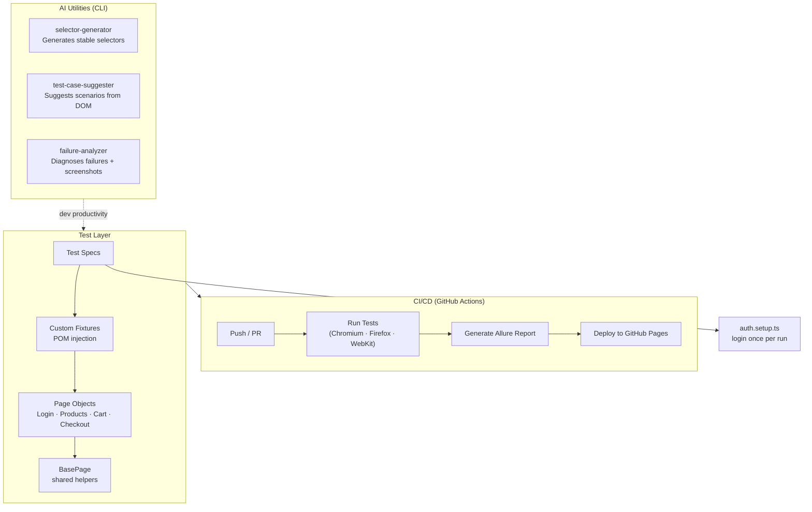

# AI-Driven E2E Playwright

<p align="center">
  
</p>

[](https://github.com/dinoudon/ai-driven-e2e-playwright/actions)
[](https://playwright.dev)
[](https://www.typescriptlang.org)
[](https://dinoudon.github.io/ai-driven-e2e-playwright/)

End-to-end test automation portfolio using Playwright and TypeScript, with AI-powered developer tools for selector generation, test case suggestion, and failure analysis.

---

## Live Report

> Allure test report auto-deployed on every push: **[dinoudon.github.io/ai-driven-e2e-playwright](https://dinoudon.github.io/ai-driven-e2e-playwright/)**

---

## Architecture



---

## What It Tests

Target: [SauceDemo](https://www.saucedemo.com) — a realistic e-commerce app with intentional test scenarios.

| Flow | Coverage | Tags |
|------|----------|------|
| Login / Auth | Deep (8 tests) | `@smoke` `@negative` `@edge-case` |
| Product Browsing | Standard (4 tests) | `@smoke` `@regression` |
| Shopping Cart | Standard (3 tests) | `@regression` |
| Checkout | Deep (9 tests) | `@smoke` `@negative` `@edge-case` |

---

## Project Structure

```
src/
├── fixtures/
│   └── test.fixture.ts        # Wires all POM instances into tests
├── pages/                     # Page Object Models
│   ├── BasePage.ts            # Shared helpers (navigate, wait, assert)
│   ├── LoginPage.ts
│   ├── ProductsPage.ts
│   ├── CartPage.ts
│   └── CheckoutPage.ts
└── utils/ai/                  # AI-powered CLI tools
    ├── selector-generator.ts  # Stable selector suggestions
    ├── test-case-suggester.ts # Test scenario generation from DOM
    └── failure-analyzer.ts    # Screenshot-aware failure diagnosis

tests/
├── auth.setup.ts              # Runs once, caches session to .auth/
├── auth/login.spec.ts
├── products/products.spec.ts
├── cart/cart.spec.ts
└── checkout/checkout.spec.ts
```

---

## Key Patterns

**Session caching** — `auth.setup.ts` logs in once per run and saves `storageState`. All feature tests inherit the session, no repeated logins.

**Stable selectors** — All selectors use `data-test` attributes. No XPath, no `waitForTimeout()`.

**Tagged tests** — Run targeted subsets:

```bash
npx playwright test --grep @smoke
npx playwright test --grep @negative
```

**AI utilities** — Three CLI tools powered by the Claude API assist during development (not at runtime):

```bash
# Suggest selectors for an element
npx ts-node src/utils/ai/selector-generator.ts --url https://... --element "login button"

# Generate test scenarios from a page
npx ts-node src/utils/ai/test-case-suggester.ts --url https://...

# Analyze a test failure
npx ts-node src/utils/ai/failure-analyzer.ts --error "TimeoutError" --screenshot ./failure.png
```

---

## Running Tests

```bash
# Install
npm install
npx playwright install

# Run all tests
npx playwright test

# Run with UI mode
npx playwright test --ui

# Generate and open Allure report
npx allure generate allure-results --clean -o allure-report
npx allure open allure-report
```

---

## Tech Stack

| | |
|--|--|
| Test Framework | Playwright 1.50 |
| Language | TypeScript 5.3 |
| AI Integration | Anthropic Claude API |
| Reporting | Allure 3 |
| CI/CD | GitHub Actions |
| Browsers | Chromium · Firefox · WebKit |
| Code Quality | ESLint · Prettier |
